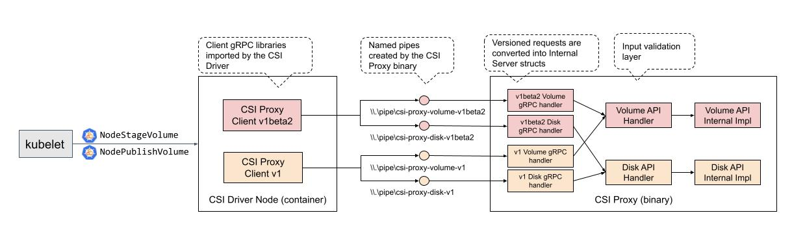
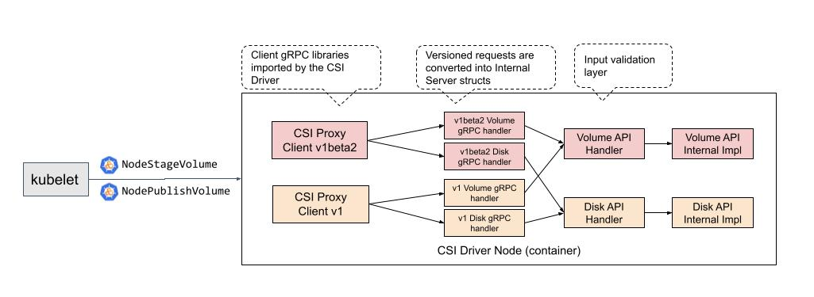
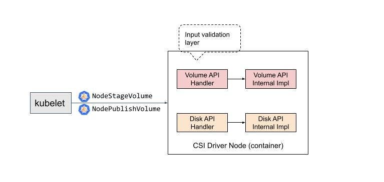

<!--
**Note:** When your KEP is complete, all of these comment blocks should be removed.

To get started with this template:

- [x] **Pick a hosting SIG.**
  Make sure that the problem space is something the SIG is interested in taking
  up. KEPs should not be checked in without a sponsoring SIG.
- [x] **Create an issue in kubernetes/enhancements**
  When filing an enhancement tracking issue, please make sure to complete all
  fields in that template. One of the fields asks for a link to the KEP. You
  can leave that blank until this KEP is filed, and then go back to the
  enhancement and add the link.
- [x] **Make a copy of this template directory.**
  Copy this template into the owning SIG's directory and name it
  `NNNN-short-descriptive-title`, where `NNNN` is the issue number (with no
  leading-zero padding) assigned to your enhancement above.
- [x] **Fill out as much of the kep.yaml file as you can.**
  At minimum, you should fill in the "Title", "Authors", "Owning-sig",
  "Status", and date-related fields.
- [x] **Fill out this file as best you can.**
  At minimum, you should fill in the "Summary" and "Motivation" sections.
  These should be easy if you've preflighted the idea of the KEP with the
  appropriate SIG(s).
- [ ] **Create a PR for this KEP.**
  Assign it to people in the SIG who are sponsoring this process.
- [ ] **Merge early and iterate.**
  Avoid getting hung up on specific details and instead aim to get the goals of
  the KEP clarified and merged quickly. The best way to do this is to just
  start with the high-level sections and fill out details incrementally in
  subsequent PRs.

Just because a KEP is merged does not mean it is complete or approved. Any KEP
marked as `provisional` is a working document and subject to change. You can
denote sections that are under active debate as follows:

```
<<[UNRESOLVED optional short context or usernames ]>>
Stuff that is being argued.
<<[/UNRESOLVED]>>
```

When editing KEPS, aim for tightly-scoped, single-topic PRs to keep discussions
focused. If you disagree with what is already in a document, open a new PR
with suggested changes.

One KEP corresponds to one "feature" or "enhancement" for its whole lifecycle.
You do not need a new KEP to move from beta to GA, for example. If
new details emerge that belong in the KEP, edit the KEP. Once a feature has become
"implemented", major changes should get new KEPs.

The canonical place for the latest set of instructions (and the likely source
of this file) is [here](/keps/NNNN-kep-template/README.md).

**Note:** Any PRs to move a KEP to `implementable`, or significant changes once
it is marked `implementable`, must be approved by each of the KEP approvers.
If none of those approvers are still appropriate, then changes to that list
should be approved by the remaining approvers and/or the owning SIG (or
SIG Architecture for cross-cutting KEPs).
-->
# KEP-3636: CSI Drivers in Windows as HostProcess Pods

<!--
A table of contents is helpful for quickly jumping to sections of a KEP and for
highlighting any additional information provided beyond the standard KEP
template.

Ensure the TOC is wrapped with
  <code>&lt;!-- toc --&rt;&lt;!-- /toc --&rt;</code>
tags, and then generate with `hack/update-toc.sh`.
-->

<!-- toc -->
- [Release Signoff Checklist](#release-signoff-checklist)
- [Summary](#summary)
  - [Glossary](#glossary)
- [Motivation](#motivation)
  - [Goals](#goals)
  - [Non-Goals](#non-goals)
- [Proposal](#proposal)
  - [Notes/Constraints/Caveats](#notesconstraintscaveats)
  - [Risks and Mitigations](#risks-and-mitigations)
- [Design Details](#design-details)
  - [Prerequisite: Make CSI Proxy an embedded library without a server component](#prerequisite-make-csi-proxy-an-embedded-library-without-a-server-component)
  - [Implementation idea 1: Update the conversion layer to use the server code gRPC](#implementation-idea-1-update-the-conversion-layer-to-use-the-server-code-grpc)
  - [Implementation idea 2: Update the CSI Drivers to use the server code directly (preferred)](#implementation-idea-2-update-the-csi-drivers-to-use-the-server-code-directly-preferred)
  - [Implementation idea 3: Convert CSI Proxy to a Library of Functions](#implementation-idea-3-convert-csi-proxy-to-a-library-of-functions)
  - [Comparison Matrix](#comparison-matrix)
  - [Maintenance of the new model and existing client/server model of CSI Proxy](#maintenance-of-the-new-model-and-existing-clientserver-model-of-csi-proxy)
  - [Security analysis](#security-analysis)
  - [Test Plan](#test-plan)
    - [Unit tests](#unit-tests)
    - [Integration tests](#integration-tests)
    - [e2e tests](#e2e-tests)
  - [Graduation Criteria](#graduation-criteria)
  - [Upgrade / Downgrade Strategy](#upgrade--downgrade-strategy)
  - [Version Skew Strategy](#version-skew-strategy)
- [Production Readiness Review Questionnaire](#production-readiness-review-questionnaire)
  - [Feature Enablement and Rollback](#feature-enablement-and-rollback)
  - [Rollout, Upgrade and Rollback Planning](#rollout-upgrade-and-rollback-planning)
  - [Monitoring Requirements](#monitoring-requirements)
  - [Dependencies](#dependencies)
  - [Scalability](#scalability)
  - [Troubleshooting](#troubleshooting)
- [Implementation History](#implementation-history)
- [Drawbacks](#drawbacks)
- [Alternatives](#alternatives)
- [Infrastructure Needed (Optional)](#infrastructure-needed-optional)
<!-- /toc -->

## Release Signoff Checklist

<!--
**ACTION REQUIRED:** In order to merge code into a release, there must be an
issue in [kubernetes/enhancements] referencing this KEP and targeting a release
milestone **before the [Enhancement Freeze](https://git.k8s.io/sig-release/releases)
of the targeted release**.

For enhancements that make changes to code or processes/procedures in core
Kubernetes—i.e., [kubernetes/kubernetes], we require the following Release
Signoff checklist to be completed.

Check these off as they are completed for the Release Team to track. These
checklist items _must_ be updated for the enhancement to be released.
-->

Items marked with (R) are required *prior to targeting to a milestone / release*.

- [ ] (R) Enhancement issue in release milestone, which links to KEP dir in [kubernetes/enhancements] (not the initial KEP PR)
- [ ] (R) KEP approvers have approved the KEP status as `implementable`
- [ ] (R) Design details are appropriately documented
- [ ] (R) Test plan is in place, giving consideration to SIG Architecture and SIG Testing input (including test refactors)
  - [ ] e2e Tests for all Beta API Operations (endpoints)
  - [ ] (R) Ensure GA e2e tests meet requirements for [Conformance Tests](https://github.com/kubernetes/community/blob/master/contributors/devel/sig-architecture/conformance-tests.md)
  - [ ] (R) Minimum Two Week Window for GA e2e tests to prove flake free
- [ ] (R) Graduation criteria is in place
  - [ ] (R) [all GA Endpoints](https://github.com/kubernetes/community/pull/1806) must be hit by [Conformance Tests](https://github.com/kubernetes/community/blob/master/contributors/devel/sig-architecture/conformance-tests.md)
- [ ] (R) Production readiness review completed
- [ ] (R) Production readiness review approved
- [ ] "Implementation History" section is up-to-date for milestone
- [ ] User-facing documentation has been created in [kubernetes/website], for publication to [kubernetes.io]
- [ ] Supporting documentation—e.g., additional design documents, links to mailing list discussions/SIG meetings, relevant PRs/issues, release notes

<!--
**Note:** This checklist is iterative and should be reviewed and updated every time this enhancement is being considered for a milestone.
-->

[kubernetes.io]: https://kubernetes.io/
[kubernetes/enhancements]: https://git.k8s.io/enhancements
[kubernetes/kubernetes]: https://git.k8s.io/kubernetes
[kubernetes/website]: https://git.k8s.io/website

## Summary

<!--
This section is incredibly important for producing high-quality, user-focused
documentation such as release notes or a development roadmap. It should be
possible to collect this information before implementation begins, in order to
avoid requiring implementors to split their attention between writing release
notes and implementing the feature itself. KEP editors and SIG Docs
should help to ensure that the tone and content of the `Summary` section is
useful for a wide audience.

A good summary is probably at least a paragraph in length.

Both in this section and below, follow the guidelines of the [documentation
style guide]. In particular, wrap lines to a reasonable length, to make it
easier for reviewers to cite specific portions, and to minimize diff churn on
updates.

[documentation style guide]: https://github.com/kubernetes/community/blob/master/contributors/guide/style-guide.md
-->

CSI enables third-party storage providers to write and deploy plugins without the need
to alter the core Kubernetes codebase.

A CSI Driver in Kubernetes has two main components: a controller plugin which runs in
the control plane and a node plugin which runs on every node.

The node component of a CSI Driver require direct access to the host for making block devices and/or filesystems
available to the kubelet, CSI Drivers use the [mkfs(8)](https://man7.org/linux/man-pages/man8/mkfs.8.html) and
[mount(8)](https://man7.org/linux/man-pages/man8/mount.8.html) commands format and mount filesystems.
CSI Drivers running in Windows nodes can't execute similar Windows commands due to the missing capability
of running privileged operations from a container. To workaround this issue a proxy binary called [CSI Proxy was
introduced](https://kubernetes.io/blog/2020/04/03/kubernetes-1-18-feature-windows-csi-support-alpha/) as a way to
perform privileged storage operations by relaying the execution of these privileged storage operations to it, CSI
Drivers connect to a gRPC API exposed by CSI Proxy as named pipes in the host and invoke the CSI Proxy API services
to execute privileged powershell commands to mount and format filesystems on behalf of the CSI Driver. [CSI Proxy
became GA in Kubernetes 1.22](https://kubernetes.io/blog/2021/08/09/csi-windows-support-with-csi-proxy-reaches-ga/).

At around the same time, SIG Windows introduced [HostProcess containers](https://kubernetes.io/blog/2021/08/16/windows-hostprocess-containers/),
this feature enables running containers as a process in the host (hence the name),
with this feature CSI Drives can directly perform the same privileged storage operations
that CSI Proxy did, this KEP explains the process to transition CSI Drivers to become HostProcess containers.

### Glossary

A few terms for reference as this document is read:

* API Group - A grouping of APIs in CSI Proxy by their purpose, for example the Volume API Group has API Methods related with volume interaction, [there are 4 API groups (Disk, Fileyste, Volume, SMB) in v1 status and 2 in v1beta status](https://github.com/kubernetes-csi/csi-proxy/blob/c0c6293490fd8aec269685bb4089be56d69921b1/README.md#feature-status).
* API Version - an API Group can have multiple versions e.g. v1alpha1, v1beta1, v1, etc. [As of GA there are 4 API groups (Disk, Fileyste, Volume, SMB) in v1 status and 2 API Groups (iSCSI, System) in v1beta status](https://github.com/kubernetes-csi/csi-proxy/blob/c0c6293490fd8aec269685bb4089be56d69921b1/README.md#feature-status).
* Conversion layer - Generated go code in CSI Proxy that transforms client versioned requests to server "version agnostic" requests.
* CSI Proxy client - The library that CSI Drivers and addons use to connect to the CSI Proxy server.
* CSI Proxy server - The CSI Proxy binary running in the host node.

## Motivation

<!--
This section is for explicitly listing the motivation, goals, and non-goals of
this KEP.  Describe why the change is important and the benefits to users. The
motivation section can optionally provide links to [experience reports] to
demonstrate the interest in a KEP within the wider Kubernetes community.

[experience reports]: https://github.com/golang/go/wiki/ExperienceReports
-->

CSI Proxy enabled running CSI in Windows nodes using a client/server model, the server is the CSI Proxy binary
running as a Windows service in the node, the client is the CSI Driver which communicates with CSI Proxy on
every CSI call done on the node plugin. While this model has worked fine it has a few drawbacks:

- Different deployment model than Linux - Linux privileged containers are used to perform the privileged storage
  operations (format/mount), Windows containers aren't privileged so as a workaround the CSI Driver is run as non-privileged
  and privileged operations are relayed to CSI Proxy. In terms of manifests the Windows component needs to have an
  additional section to do a hostpath mount of the named pipes exposed by CSI Proxy.
- Additional component in the host to maintain - The cluster administrator needs to install and run CSI Proxy
  during the node bootstrap, the cluster administrator also needs to think about the upgrade scenario in addition to
  upgrading the CSI Driver.
- Difficult releases of bugfixes & features - After a bugfix we create a new version of the CSI Proxy which needs
  to be redeployed in the cluster, after a feature is merged in addition to redeploying a new version of CSI Proxy
  the client needs to be updated with a new version of the CSI Proxy client and connect to the new version of the named pipes,
  this workflow is not as simple as the Linux counterpart which only needs to update Go dependencies.
- Multiple API versions to maintain - As part of the original design of CSI Proxy it was decided to have different
  protobuf versions whenever there were breaking changes (like updates in the protobuf services & messages), this lead
  to having multiple versions of the API (v1alphaX, v1betaX, v1). In addition, if we want to add a new feature we'd need
  to create a new API version e.g. v2alpha1 ([see this PR as an example of adding methods to the Volume API Group](https://github.com/kubernetes-csi/csi-proxy/pull/186)).

In 1.22 SIG Windows introduced [HostProcess containers](https://kubernetes.io/blog/2021/08/16/windows-hostprocess-containers/)
as an alternative way to run containers, HostProcess containers run directly in the host
and have a behavior similar to that of a regular process.

Using HostProcess containers in CSI Drivers enables CSI Drivers to perform the privileged storage operations
directly, most of the drawbacks in the client/server model are no longer present in the new model.

### Goals

<!--
List the specific goals of the KEP. What is it trying to achieve? How will we
know that this has succeeded?
-->

- Identify the pros/cons of the different ways to transition CSI Drivers to become HostProcess containers - This
  includes changes in dependent components like CSI Proxy, it also includes defining the changes in the CSI Drivers.
- Identify the security implications of running CSI Drivers as HostProcess containers - Like the Linux counterpart
  the cluster needs to have security policies defining in which scenarios it should be enabled, we'll aim to make
  a similar analysis for Windows.

### Non-Goals

<!--
What is out of scope for this KEP? Listing non-goals helps to focus discussion
and make progress.
-->
- Improve the performance of CSI Drivers in Windows - There should be an improvement in the performance by
  removing the communication aspects between the CSI Driver and CSI Proxy (the protobuf serialization/deserialization,
  the gRPC call through named pipes) however this improvement might not be noticeable, most of the latency
  comes from doing the format/mount operations through powershell commands which is outside the scope of this change.
- Define security implementation details - A goal is to understand the security implications of enabling HostProcess
  containers, we aim to provide guidelines but not implementation details about the components that need to be installed
  in the cluster.

## Proposal

<!--
This is where we get down to the specifics of what the proposal actually is.
This should have enough detail that reviewers can understand exactly what
you're proposing, but should not include things like API designs or
implementation. What is the desired outcome and how do we measure success?.
The "Design Details" section below is for the real
nitty-gritty.
-->
As part of the transition of CSI Drivers to HostProcess containers we would like to:

- Refactor the CSI Proxy codebase to become a Go library in favor of the current client/server model.
- Define guidelines for the transition of CSI Drivers to HostProcess containers, both the changes in the Go code
  and the way it's deployed and some considerations about security.

### Notes/Constraints/Caveats

<!--
What are the caveats to the proposal?
What are some important details that didn't come across above?
Go in to as much detail as necessary here.
This might be a good place to talk about core concepts and how they relate.
-->
HostProcess containers run as processes in the host, one of the differences with a privileged Linux container
is that there's no filesystem isolation, this means that enabling HostProcess containers should be done for
system components only. This point will be expanded in the detailed design.

### Risks and Mitigations

<!--
What are the risks of this proposal, and how do we mitigate? Think broadly.
For example, consider both security and how this will impact the larger
Kubernetes ecosystem.

How will security be reviewed, and by whom?

How will UX be reviewed, and by whom?

Consider including folks who also work outside the SIG or subproject.
-->

Security implications of HostProcess containers will be reviewed by the SIG Windows team and the SIG Storage team
initially.


## Design Details

<!--
This section should contain enough information that the specifics of your
change are understandable. This may include API specs (though not always
required) or even code snippets. If there's any ambiguity about HOW your
proposal will be implemented, this is the place to discuss them.
-->

The following paragraphs summarize the architecture of CSI Proxy, how CSI Drivers use it, the purpose of the conversion
layer of CSI Proxy that enables backward compatibility with previous API Versions and a description of the files
generated by the conversion layer used in CSI Proxy.

CSI Proxy has a client/server design with two main components:

* a binary that runs in the host (aka CSI Proxy server), this binary can execute privileged storage operations on the
  host, once configured to run as a Windows service it creates named pipes on startup for all the versions of the API
  Groups defined on the codebase.
* client go libraries that CSI Drivers and Addons import to connect to the CSI Proxy server, the methods and objects
  available in the library are defined with [protobuf](https://github.com/kubernetes-csi/csi-proxy#feature-status), on
  startup the CSI Driver initializes a client for each version of the API Groups required which will connect and issue
  requests through gRPC to their pre-configured named pipes on the host.

CSI Driver implementers can write a Windows specific implementation of the node component of the CSI Driver. In the
implementation a CSI Driver will make use of the imported CSI Proxy client libraries to issue privileged storage
operations, assuming that a volume was created and attached to a node by the controller component of the CSI Driver
the following CSI calls will be done by the kubelet to the CSI Driver.

**Volume set up**

* NodeStageVolume - Create a Windows volume, format it to NTFS, create a partition access path in the node (global mount).
* NodePublishVolume - Create a symlink from the kubelet Pod-PVC path to the global path (pod mount).

**Volume tear down**

* NodeUnpublishVolume - Remove the symlink created above.
* NodeUnstageVolume - Remove the partition access path.

CSI Proxy is designed to be backwards compatible and a single binary running in the Windows node can serve requests from
multiple CSI Proxy client versions, we're able to do this because the CSI Proxy binary on startup will create named
pipes for all the versions available in every API Group (e.g. the Volume, Disk, Filesystem, SMB groups), in addition,
there's a conversion layer in the CSI Proxy binary that transform client version specific requests to server "version
agnostic" requests which are then processed by the CSI Proxy binary, the following diagram shows the conversion process
(from the [CSI Proxy development docs](https://github.com/kubernetes-csi/csi-proxy/blob/c0c6293490fd8aec269685bb4089be56d69921b1/docs/DEVELOPMENT.md)):



Understanding the conversion layer will help in the transition to HostProcess containers as most of the code that the
clients use to communicate with the CSI Proxy server is generated. The conversion layer objective is to generate go code
that maps the versioned client requests to server agnostic requests, it does so by analyzing the generated api.pb.go
files (generated through `protoc` from the protobuf files) for each version of the API Groups and generating multiple
files for different purposes (taking as example the Volume API Group):


* [\<version\>/server_generated.go](https://github.com/kubernetes-csi/csi-proxy/blob/c0c6293490fd8aec269685bb4089be56d69921b1/pkg/server/volume/impl/v1beta3/server_generated.go)
  - The gRPC server implementation of the methods of a versioned API Group, each method receives a versioned request and
    expects a versioned response, the code generated follows this pattern:

```
func v1Foo(v1Request v1FooRequest) v1FooResponse {

  // convert versioned request to server request (version agnostic)
  fooRequest = convertV1FooRequestToFooRequest(v1Request)

  // process request (server handler)
  fooResponse = server.Foo(fooRequest)

  // convert server response (version agnostic) to versioned response
  v1Response = convertFooResponseToV1FooResponse(fooResponse)

  return v1Response
}
```


* [types_generated.go](https://github.com/kubernetes-csi/csi-proxy/blob/c0c6293490fd8aec269685bb4089be56d69921b1/pkg/server/volume/impl/types_generated.go)
  the idea is to collect all the methods available across all the versions of an API Group so that the server has a
  corresponding implementation for it, the generator reads all the methods found across the
  volume/&lt;version>/api.pb.go files and generates an interface with all the methods found that the server must
  implement, in the example above the server interface will have the `Foo` method
* [\<version\>/conversion_generated.go](https://github.com/kubernetes-csi/csi-proxy/blob/c0c6293490fd8aec269685bb4089be56d69921b1/pkg/server/volume/impl/v1/conversion_generated.go)
  The generated implementation of the conversion functions shown above (e.g. `convertV1FooRequestToFooRequest`,
  `convertFooResponseToV1FooResponse`) in some cases it's possible that the conversion code generator generates a nested
  data structure that's not built correctly, there's an additional file with overrides for the functions that were
  generated incorrectly.
* client [\<API Group\>/\<version\>/client_generated.go](https://github.com/kubernetes-csi/csi-proxy/blob/c0c6293490fd8aec269685bb4089be56d69921b1/client/groups/volume/v1/client_generated.go)
  Generated in the client libraries to be used by users of the CSI Proxy client, it creates proxy methods corresponding
  to the api.pb.go methods of the versioned API Group, this file defines the logic to create a connection to the
  corresponding named pipe creating a gRPC client out of it and storing it for later usage, as a result, the proxy
  methods don't need a reference to the gRPC client.


### Prerequisite: Make CSI Proxy an embedded library without a server component

If we configure the Windows node component of a CSI Driver/Addon to be a Windows HostProcess pod then it'll be able to
use the same powershell commands that we use in the server code of CSI Proxy, the idea is to use the server code of CSI
Proxy as a library in CSI Drivers/Addons. With this, we also remove the server component.

As described in the [Windows HostProcess Pod](https://kubernetes.io/docs/tasks/configure-pod-container/create-hostprocess-pod/)
guide we'd need to configure the PodSpec of node component of the CSI Driver/Addon that runs in Windows nodes with:


```yaml
spec:
  securityContext:
    windowsOptions:
      hostProcess: true
      runAsUserName: "NT AUTHORITY\\SYSTEM"
```


### Implementation idea 1: Update the conversion layer to use the server code gRPC

Modify the implementation of [\<API Group\>/\<version\>/client_generated.go](https://github.com/kubernetes-csi/csi-proxy/blob/c0c6293490fd8aec269685bb4089be56d69921b1/client/groups/volume/v1/client_generated.go)
so that it calls the server implementation directly (which should be part of the imported go module), the current
implementation uses `w.client` which is the gRPC client:


```go
func (w *Client) GetVolumeStats(
  context context.Context,
  request *v1.GetVolumeStatsRequest,
  opts ...grpc.CallOption
) (*v1.GetVolumeStatsResponse, error) {
        return w.client.GetVolumeStats(context, request, opts...)
}
```


The new implementation should use the server code instead, in the server code `volumeserver` is the implementation agnostic server that's instantiated by every versioned client `volumeservervX` e.g.


```go
import  v1 "github.com/kubernetes-csi/csi-proxy/client/api/volume/v1"
import volumeserver "github.com/kubernetes-csi/csi-proxy/pkg/server/volume"
import volumeserverv1 "github.com/kubernetes-csi/csi-proxy/pkg/server/volume/v1"

// initialize all the versioned volume servers i.e. do what cmd/csi-proxy does but on the client
serverImpl := volumeserver.NewServer()

// shim that would need to be auto generated for every version
serverv1 := volumeserverv1.NewVersionedServer(serverImpl)

// client still calls the conversion handler code
func (w *Client) GetVolumeStats(
  context context.Context,
  request *v1.GetVolumeStatsRequest
) (*v1.GetVolumeStatsResponse, error) {
        return serverv1.GetVolumeStats(context, request)
}
```



Pros:

* We get to reuse the protobuf code.
* We would still support the client/server model as this is a new method that clients would use.
* We only need to change the client import paths to use the alternative version that doesn't connect to the server with
  gRPC, which minimizes the changes necessary in the client code.

Cons:

* New APIs would need to be added to the protobuf file, and we would need to run the code generation tool again, with
  the rule of not modifying already released API Groups. This means that we would also need to create another API Group
  version for a new API.
* We still have two distinct concepts of version: the Go module version and the API version. Given that we want to use
  CSI Proxy as a library, it makes sense to use the Go module version as the source of truth and implement a single API
  version in each Go version.

### Implementation idea 2: Update the CSI Drivers to use the server code directly (preferred)

Modify the client code to use the server API handlers directly which would call the server implementation next, this
means that the concept of an "API version" is also removed from the codebase, the clients instead would import and use
the internal server structs (request and response objects).

Currently, GCE PD CSI driver uses the v1 Filesystem API group as follows:


```go
// note the API version in the imports
import  fsapi "github.com/kubernetes-csi/csi-proxy/client/api/filesystem/v1"
import  fsclient "github.com/kubernetes-csi/csi-proxy/client/groups/filesystem/v1"
func NewCSIProxyMounterV1() (*CSIProxyMounterV1, error) {
        fsClient, err := fsclient.NewClient()
        if err != nil {
                return nil, err
        }
        return &CSIProxyMounterV1{
                FsClient:     fsClient,
        }, nil
}

// ExistsPath - Checks if a path exists. Unlike util ExistsPath, this call does not perform follow link.
func (mounter *CSIProxyMounterV1) PathExists(path string) (bool, error) {
        isExistsResponse, err := mounter.FsClient.PathExists(context.Background(),
                &fsapi.PathExistsRequest{
                        Path: mount.NormalizeWindowsPath(path),
                })
        if err != nil {
                return false, err
        }
        return isExistsResponse.Exists, err
}

// usage
csiProxyV1, _ := NewCSIProxyMounterV1()
csiProxyV1.PathExists(path)
```


Internally the PathExists call is in the file [\<API Group\>/\<version\>/client_generated.go](https://github.com/kubernetes-csi/csi-proxy/blob/c0c6293490fd8aec269685bb4089be56d69921b1/client/groups/volume/v1/client_generated.go)
described above which performs the execution through gRPC, in the proposal we'd need to use the server implementation
instead

```go
// note that there is no version in the import
import fsserver "github.com/kubernetes-csi/csi-proxy/pkg/server/filesystem"
import fsserverimpl "github.com/kubernetes-csi/csi-proxy/pkg/server/filesystem/impl"
import fsapi "github.com/kubernetes-csi/csi-proxy/pkg/os/filesystem"

// no need to initialize a gRPC client, however the server handler impl is initialized instead
// no need for a versioned client

func NewCSIProxyMounter() (*CSIProxyMounter, error) {
  fsServer, err := fsserver.NewServer(fsapi.New())
  if err != nil {
    return nil, err
  }
  return &CSIProxyMounter{
    FsServer: fsServer,
  }, nil
}

// ExistsPath - Checks if a path exists. Unlike util ExistsPath, this call does not perform follow link.
func (mounter *CSIProxyMounter) PathExists(path string) (bool, error) {
        isExistsResponse, err := mounter.FsServer.PathExists(context.Background(),
                &fsserverimpl.PathExistsRequest{
                        Path: mount.NormalizeWindowsPath(path),
                },
                // 3rd arg is the version, remove the version here too!
        )
        if err != nil {
                return false, err
        }
        return isExistsResponse.Exists, err
}

// usage
csiProxy, _ := NewCSIProxyMounter()
csiProxy.PathExists(path)
```



Pros:

* We remove the concept of API Version & the conversion layer and instead consider the go mod version as the API
  version. This is how other libraries like k8s.io/mount-utils work.
    * Version dependent server validation in the API handler layer is removed.
    * Legacy structs for older API versions are removed.
* New APIs are easier to add. Only the server handler & impl code is modified, so there’s no need for the code
  generation tool anymore.

Cons:

* The client goes through a bigger diff. Every occurrence of a call to a CSI Proxy method needs to be modified to use
  the server handler & impl code, but this penalty is paid only once.
    * Legacy interface implementations for the v1beta API in the CSI Drivers are removed.
* As we no longer use protobuf to define the API and use internal structs instead, we'd need to update the API docs to
  be directly generated from source code (including the comments around server handler methods and internal server
  structs).

It is worth noting that at this point, the notion of a server is no longer valid, as CSI Proxy has become a
library. We can take this opportunity to reorganize the packages by (a) moving /pkg/server/\<API Group\> and
/pkg/server/\<API Group\>/impl to /pkg/\<API Group\> (b) moving /pkg/os/\<API Group\> to /pkg/\<API Group\>/api.
The new structure looks like:


```
pkg
├── disk
│   ├── api
│   │   ├── api.go
│   │   └── types.go
│   ├── disk.go
│   └── types.go
├── iscsi
│   ├── api
│   │   ├── api.go
│   │   └── types.go
│   ├── disk.go
│   └── types.go
```

There are also three minor details we can take care of while we’re migrating:

1. The two structs under pkg/shared/disk/types.go are only ever referenced by pkg/os/disk, so they can be safely added
   to pkg/disk/api/types.go.
2. The FS server receives workingDirs as an input, in addition to the OS API. It’s only used to sandbox what directories
   the CSI Proxy is enabled to operate on. Now that control is part of the CSI Driver, we can safely remove it.
3. pkg/os/filesystem is no longer necessary, as the implementation just calls out to the Golang standard library os
   package. We can deprecate it in release notes and remove in a future release.

### Implementation idea 3: Convert CSI Proxy to a Library of Functions

With the new changes, CSI Proxy is effectively just a library of Go functions mapping to Windows commands. The notion of
servers and clients is no longer relevant, so it makes sense to restructure the package into a library of functions,
with each API Group’s interfacing functions and types provided under pkg/\<API Group\> (right now, these files sit at
pkg/server/\<API Group\>/server.go and pkg/server/\<API Group\>/impl/types.go). The OS-facing API at /pkg/os is kept
is, and the corresponding OS API struct is initialized globally inside each pkg/\<API Group\> (to allow for subbing
during testing). All other code can be safely deleted.

```go
// there is now only one single import
import fs "github.com/kubernetes-csi/csi-proxy/pkg/fs"

// there is no longer a need to initialize a server
func NewCSIProxyMounter() *CSIProxyMounter {
  return &CSIProxyMounter{
  }
}

// ExistsPath - Checks if a path exists. Unlike util ExistsPath, this call does not perform follow link.
func (*CSIProxyMounter) PathExists(path string) (bool, error) {
        // both mounter.FsServer and fsserverimpl are changed to just fs
        isExistsResponse, err := fs.PathExists(context.Background(),
                &fs.PathExistsRequest{
                        Path: mount.NormalizeWindowsPath(path),
                }
        )
        if err != nil {
                return false, err
        }
        return isExistsResponse.Exists, err
}

// usage
csiProxy := NewCSIProxyMounter()
csiProxy.PathExists(path)

// at test time
fs.UseAPI(mockAPI)
// run tests…
fs.ResetAPI()
```

This is the most invasive option of all three. Specifically, we combine the two imports into one and move to a pure
function paradigm. However, the method implementation sees very minimal changes, requiring only import path updates.

Pros:

* Like implementation idea 2, we switch to a single notion of version via Go modules.
* The pure function paradigm more accurately reflects the nature of the new design, which simplifies how clients use the
  library.
* Like implementation idea 2, new APIs are easier to add by moving away from code generation.

Cons:

* There is now an implicit dependency on the os API package-level variable. Testing can still be done by subbing out the
  variable with a mock implementation during test time.
* More work (2 imports -> 1, remove server initialization, replace function call and request type package names) needs
  to be done by clients to adapt to the new change, though it’s not that much more than implementation idea 2. Again,
  the price is only paid once.
* Like impl idea 2, we also need to transition our API doc generation to generate from Go source.


### Comparison Matrix

| |Idea 1: Update the conversion layer to use the server code gRPC|Idea 2: Update the CSI Drivers to use the server code directly (preferred)|Idea 3: Convert CSI Proxy to a Library of Functions|
| --- |--- |--- |--- |
| Adoption cost|Minimal (only changing imports)|Considerate (imports and API calls)|Considerate (imports, API calls, and initialization)|
| Future development|Still need code generation and and protobuf|Directly add methods to Go code, but leaves legacy notion of “server”|Directly add functions to Go code. Code base cleaned up|
| Versioning|Both Go mod version and API version are maintained|Go mod version only|Go mod version only|
| Testing|Current tests should still work.|Current tests should still work.|OS API mocking needs to be subbed in, as we have an implicit dependency|
| Support for legacy client/server model|Still supported|Not supported|Not supported|


### Maintenance of the new model and existing client/server model of CSI Proxy

The `library-development` branch will be used for the development of this model, `master` will have the existing
client/server mode. We plan to create alpha tags on the `library-development` branch and use it in CSI Drivers,
next once it's integrated we will create a v2 tag, make `library-deveopment` the new default (`master` will point
to the new implementation, `v1.x` will point to the existing one).

`v1.x` will still be open for urgent bug fixes but new features should go into the new model.

### Security analysis

We suggest enabling HostProcess containers only for system workloads, one of the drawbacks of this new mode is the
lack of filesystem isolation which means that HostProcess containers have entire visibility of the host fileystem,
to prevent workloads from accessing specific paths in the host we recommend:

- Creating a Windows user with limited permissions to create files under the kubelet controlled path `C:\var\lib\kubelet`
- Enabling PodSecurityAdmission on the namespace where system components run, note that this needs an additiona
  admission webhook to be installed in the cluster.

### Test Plan

#### Unit tests

<!--
In principle every added code should have complete unit test coverage, so providing
the exact set of tests will not bring additional value.
However, if complete unit test coverage is not possible, explain the reason of it
together with explanation why this is acceptable.
-->

<!--
Additionally, for Alpha try to enumerate the core package you will be touching
to implement this enhancement and provide the current unit coverage for those
in the form of:
- <package>: <date> - <current test coverage>
The data can be easily read from:
https://testgrid.k8s.io/sig-testing-canaries#ci-kubernetes-coverage-unit

This can inform certain test coverage improvements that we want to do before
extending the production code to implement this enhancement.
-->

For CSI Proxy we already have unit tests inside `pkg/\<API Group\>`, these tests
are run on presubmit on every PR.

Examples:

- [volume tests](https://github.com/kubernetes-csi/csi-proxy/blob/c0c6293490fd8aec269685bb4089be56d69921b1/pkg/volume/volume_test.go)
- [filesystem tests](https://github.com/kubernetes-csi/csi-proxy/blob/c0c6293490fd8aec269685bb4089be56d69921b1/pkg/filesystem/filesystem_test.go)

#### Integration tests

<!--
This question should be filled when targeting a release.
For Alpha, describe what tests will be added to ensure proper quality of the enhancement.

For Beta and GA, add links to added tests together with links to k8s-triage for those tests:
https://storage.googleapis.com/k8s-triage/index.html
-->

For CSI Proxy we already have integration tests inside `integrationtests`, these tests
are run on presubmit on every PR.

Examples:

- [volume integration tests](https://github.com/kubernetes-csi/csi-proxy/blob/c0c6293490fd8aec269685bb4089be56d69921b1/integrationtests/volume_test.go)
- [filesystem integration tests](https://github.com/kubernetes-csi/csi-proxy/blob/c0c6293490fd8aec269685bb4089be56d69921b1/integrationtests/filesystem_test.go)
- [iscsi integration tests](https://github.com/kubernetes-csi/csi-proxy/blob/c0c6293490fd8aec269685bb4089be56d69921b1/integrationtests/iscsi_test.go)
- [system integration tests](https://github.com/kubernetes-csi/csi-proxy/blob/c0c6293490fd8aec269685bb4089be56d69921b1/integrationtests/system_test.go)
- [smb integration tests](https://github.com/kubernetes-csi/csi-proxy/blob/c0c6293490fd8aec269685bb4089be56d69921b1/integrationtests/smb_test.go)
- [disk integration tests](https://github.com/kubernetes-csi/csi-proxy/blob/c0c6293490fd8aec269685bb4089be56d69921b1/integrationtests/disk_test.go)

#### e2e tests

<!--
This question should be filled when targeting a release.
For Alpha, describe what tests will be added to ensure proper quality of the enhancement.

For Beta and GA, add links to added tests together with links to k8s-triage for those tests:
https://storage.googleapis.com/k8s-triage/index.html

We expect no non-infra related flakes in the last month as a GA graduation criteria.
-->

OSS storage e2e tests run out of tree, we plan to migrate at least 1 CSI Driver to use the CSI Proxy library
and see the existing e2e tests passing.

### Graduation Criteria

<!--
**Note:** *Not required until targeted at a release.*

Define graduation milestones.

These may be defined in terms of API maturity, [feature gate] graduations, or as
something else. The KEP should keep this high-level with a focus on what
signals will be looked at to determine graduation.

Consider the following in developing the graduation criteria for this enhancement:
- [Maturity levels (`alpha`, `beta`, `stable`)][maturity-levels]
- [Feature gate][feature gate] lifecycle
- [Deprecation policy][deprecation-policy]

Clearly define what graduation means by either linking to the [API doc
definition](https://kubernetes.io/docs/concepts/overview/kubernetes-api/#api-versioning)
or by redefining what graduation means.

In general we try to use the same stages (alpha, beta, GA), regardless of how the
functionality is accessed.

[feature gate]: https://git.k8s.io/community/contributors/devel/sig-architecture/feature-gates.md
[maturity-levels]: https://git.k8s.io/community/contributors/devel/sig-architecture/api_changes.md#alpha-beta-and-stable-versions
[deprecation-policy]: https://kubernetes.io/docs/reference/using-api/deprecation-policy/

Below are some examples to consider, in addition to the aforementioned [maturity levels][maturity-levels].

-->
Most of the code used by CSI Drivers through CSI Proxy is already GA, this KEP is defining a new mechanism to run
the same code that the CSI Driver executes through CSI Proxy directly through the CSI Driver itself.


### Upgrade / Downgrade Strategy

<!--
If applicable, how will the component be upgraded and downgraded? Make sure
this is in the test plan.

Consider the following in developing an upgrade/downgrade strategy for this
enhancement:
- What changes (in invocations, configurations, API use, etc.) is an existing
  cluster required to make on upgrade, in order to maintain previous behavior?
- What changes (in invocations, configurations, API use, etc.) is an existing
  cluster required to make on upgrade, in order to make use of the enhancement?
-->
The following is a list of items that need to happen in different components of CSI in Windows for CSI Drivers
to become HostProcess containers:

**CSI Proxy**

- Start a development branch for the upcoming work (`library-development`).
- Refactor the filesystem, disk, volume, system, iSCSI, SMB API Groups out of the current client/server.
- Remove the client/server code from the codebase.
- Update the unit and integration tests to work with the refactored code.
- Run the integration tests in a HostProcess container.
- Update the README and DEVELOPMENT docs.
- Once the above items are completed we can create an alpha tag in the `library-development` branch to
  use it in CSI Drivers.

**CSI Driver**

- Update the CSI Proxy library to the alpha tag from the `library-development` version.
- Update the codebase import to use the server impl directly instead of the client library.
- Update the CSI Driver deployment manifest with the HostProcess container fields in the PodSpec.
- Run the e2e tests.

### Version Skew Strategy

<!--
If applicable, how will the component handle version skew with other
components? What are the guarantees? Make sure this is in the test plan.

Consider the following in developing a version skew strategy for this
enhancement:
- Does this enhancement involve coordinating behavior in the control plane and
  in the kubelet? How does an n-2 kubelet without this feature available behave
  when this feature is used?
- Will any other components on the node change? For example, changes to CSI,
  CRI or CNI may require updating that component before the kubelet.
-->
Previously, CSI Proxy has a different release cycle than the CSI Driver where each binary had its own version and
supported different CSI Proxy clients. Once CSI Proxy becomes a library the version will be managed by the go module
version instead (similar to kubernetes/mount-utils).

## Production Readiness Review Questionnaire

<!--

Production readiness reviews are intended to ensure that features merging into
Kubernetes are observable, scalable and supportable; can be safely operated in
production environments, and can be disabled or rolled back in the event they
cause increased failures in production. See more in the PRR KEP at
https://git.k8s.io/enhancements/keps/sig-architecture/1194-prod-readiness.

The production readiness review questionnaire must be completed and approved
for the KEP to move to `implementable` status and be included in the release.

In some cases, the questions below should also have answers in `kep.yaml`. This
is to enable automation to verify the presence of the review, and to reduce review
burden and latency.

The KEP must have a approver from the
[`prod-readiness-approvers`](http://git.k8s.io/enhancements/OWNERS_ALIASES)
team. Please reach out on the
[#prod-readiness](https://kubernetes.slack.com/archives/CPNHUMN74) channel if
you need any help or guidance.
-->

### Feature Enablement and Rollback

<!--
This section must be completed when targeting alpha to a release.
-->

###### How can this feature be enabled / disabled in a live cluster?

<!--
Pick one of these and delete the rest.

Documentation is available on [feature gate lifecycle] and expectations, as
well as the [existing list] of feature gates.

[feature gate lifecycle]: https://git.k8s.io/community/contributors/devel/sig-architecture/feature-gates.md
[existing list]: https://kubernetes.io/docs/reference/command-line-tools-reference/feature-gates/
-->

- [ ] Feature gate (also fill in values in `kep.yaml`)
  - Feature gate name:
  - Components depending on the feature gate:
- [ ] Other
  - Describe the mechanism:
  - Will enabling / disabling the feature require downtime of the control
    plane?
  - Will enabling / disabling the feature require downtime or reprovisioning
    of a node? (Do not assume `Dynamic Kubelet Config` feature is enabled).

###### Does enabling the feature change any default behavior?

<!--
Any change of default behavior may be surprising to users or break existing
automations, so be extremely careful here.
-->

###### Can the feature be disabled once it has been enabled (i.e. can we roll back the enablement)?

<!--
Describe the consequences on existing workloads (e.g., if this is a runtime
feature, can it break the existing applications?).

Feature gates are typically disabled by setting the flag to `false` and
restarting the component. No other changes should be necessary to disable the
feature.

NOTE: Also set `disable-supported` to `true` or `false` in `kep.yaml`.
-->

###### What happens if we reenable the feature if it was previously rolled back?

###### Are there any tests for feature enablement/disablement?

<!--
The e2e framework does not currently support enabling or disabling feature
gates. However, unit tests in each component dealing with managing data, created
with and without the feature, are necessary. At the very least, think about
conversion tests if API types are being modified.

Additionally, for features that are introducing a new API field, unit tests that
are exercising the `switch` of feature gate itself (what happens if I disable a
feature gate after having objects written with the new field) are also critical.
You can take a look at one potential example of such test in:
https://github.com/kubernetes/kubernetes/pull/97058/files#diff-7826f7adbc1996a05ab52e3f5f02429e94b68ce6bce0dc534d1be636154fded3R246-R282
-->

### Rollout, Upgrade and Rollback Planning

<!--
This section must be completed when targeting beta to a release.
-->

###### How can a rollout or rollback fail? Can it impact already running workloads?

<!--
Try to be as paranoid as possible - e.g., what if some components will restart
mid-rollout?

Be sure to consider highly-available clusters, where, for example,
feature flags will be enabled on some API servers and not others during the
rollout. Similarly, consider large clusters and how enablement/disablement
will rollout across nodes.
-->

###### What specific metrics should inform a rollback?

<!--
What signals should users be paying attention to when the feature is young
that might indicate a serious problem?
-->

###### Were upgrade and rollback tested? Was the upgrade->downgrade->upgrade path tested?

<!--
Describe manual testing that was done and the outcomes.
Longer term, we may want to require automated upgrade/rollback tests, but we
are missing a bunch of machinery and tooling and can't do that now.
-->

###### Is the rollout accompanied by any deprecations and/or removals of features, APIs, fields of API types, flags, etc.?

<!--
Even if applying deprecation policies, they may still surprise some users.
-->

### Monitoring Requirements

<!--
This section must be completed when targeting beta to a release.

For GA, this section is required: approvers should be able to confirm the
previous answers based on experience in the field.
-->

###### How can an operator determine if the feature is in use by workloads?

<!--
Ideally, this should be a metric. Operations against the Kubernetes API (e.g.,
checking if there are objects with field X set) may be a last resort. Avoid
logs or events for this purpose.
-->

###### How can someone using this feature know that it is working for their instance?

<!--
For instance, if this is a pod-related feature, it should be possible to determine if the feature is functioning properly
for each individual pod.
Pick one more of these and delete the rest.
Please describe all items visible to end users below with sufficient detail so that they can verify correct enablement
and operation of this feature.
Recall that end users cannot usually observe component logs or access metrics.
-->

- [ ] Events
  - Event Reason:
- [ ] API .status
  - Condition name:
  - Other field:
- [ ] Other (treat as last resort)
  - Details:

###### What are the reasonable SLOs (Service Level Objectives) for the enhancement?

<!--
This is your opportunity to define what "normal" quality of service looks like
for a feature.

It's impossible to provide comprehensive guidance, but at the very
high level (needs more precise definitions) those may be things like:
  - per-day percentage of API calls finishing with 5XX errors <= 1%
  - 99% percentile over day of absolute value from (job creation time minus expected
    job creation time) for cron job <= 10%
  - 99.9% of /health requests per day finish with 200 code

These goals will help you determine what you need to measure (SLIs) in the next
question.
-->

###### What are the SLIs (Service Level Indicators) an operator can use to determine the health of the service?

<!--
Pick one more of these and delete the rest.
-->

- [ ] Metrics
  - Metric name:
  - [Optional] Aggregation method:
  - Components exposing the metric:
- [ ] Other (treat as last resort)
  - Details:

###### Are there any missing metrics that would be useful to have to improve observability of this feature?

<!--
Describe the metrics themselves and the reasons why they weren't added (e.g., cost,
implementation difficulties, etc.).
-->

### Dependencies

<!--
This section must be completed when targeting beta to a release.
-->

###### Does this feature depend on any specific services running in the cluster?

<!--
Think about both cluster-level services (e.g. metrics-server) as well
as node-level agents (e.g. specific version of CRI). Focus on external or
optional services that are needed. For example, if this feature depends on
a cloud provider API, or upon an external software-defined storage or network
control plane.

For each of these, fill in the following—thinking about running existing user workloads
and creating new ones, as well as about cluster-level services (e.g. DNS):
  - [Dependency name]
    - Usage description:
      - Impact of its outage on the feature:
      - Impact of its degraded performance or high-error rates on the feature:
-->

### Scalability

<!--
For alpha, this section is encouraged: reviewers should consider these questions
and attempt to answer them.

For beta, this section is required: reviewers must answer these questions.

For GA, this section is required: approvers should be able to confirm the
previous answers based on experience in the field.
-->

###### Will enabling / using this feature result in any new API calls?

<!--
Describe them, providing:
  - API call type (e.g. PATCH pods)
  - estimated throughput
  - originating component(s) (e.g. Kubelet, Feature-X-controller)
Focusing mostly on:
  - components listing and/or watching resources they didn't before
  - API calls that may be triggered by changes of some Kubernetes resources
    (e.g. update of object X triggers new updates of object Y)
  - periodic API calls to reconcile state (e.g. periodic fetching state,
    heartbeats, leader election, etc.)
-->

###### Will enabling / using this feature result in introducing new API types?

<!--
Describe them, providing:
  - API type
  - Supported number of objects per cluster
  - Supported number of objects per namespace (for namespace-scoped objects)
-->

###### Will enabling / using this feature result in any new calls to the cloud provider?

<!--
Describe them, providing:
  - Which API(s):
  - Estimated increase:
-->

###### Will enabling / using this feature result in increasing size or count of the existing API objects?

<!--
Describe them, providing:
  - API type(s):
  - Estimated increase in size: (e.g., new annotation of size 32B)
  - Estimated amount of new objects: (e.g., new Object X for every existing Pod)
-->

###### Will enabling / using this feature result in increasing time taken by any operations covered by existing SLIs/SLOs?

<!--
Look at the [existing SLIs/SLOs].

Think about adding additional work or introducing new steps in between
(e.g. need to do X to start a container), etc. Please describe the details.

[existing SLIs/SLOs]: https://git.k8s.io/community/sig-scalability/slos/slos.md#kubernetes-slisslos
-->

###### Will enabling / using this feature result in non-negligible increase of resource usage (CPU, RAM, disk, IO, ...) in any components?

<!--
Things to keep in mind include: additional in-memory state, additional
non-trivial computations, excessive access to disks (including increased log
volume), significant amount of data sent and/or received over network, etc.
This through this both in small and large cases, again with respect to the
[supported limits].

[supported limits]: https://git.k8s.io/community//sig-scalability/configs-and-limits/thresholds.md
-->

### Troubleshooting

<!--
This section must be completed when targeting beta to a release.

For GA, this section is required: approvers should be able to confirm the
previous answers based on experience in the field.

The Troubleshooting section currently serves the `Playbook` role. We may consider
splitting it into a dedicated `Playbook` document (potentially with some monitoring
details). For now, we leave it here.
-->

###### How does this feature react if the API server and/or etcd is unavailable?

###### What are other known failure modes?

<!--
For each of them, fill in the following information by copying the below template:
  - [Failure mode brief description]
    - Detection: How can it be detected via metrics? Stated another way:
      how can an operator troubleshoot without logging into a master or worker node?
    - Mitigations: What can be done to stop the bleeding, especially for already
      running user workloads?
    - Diagnostics: What are the useful log messages and their required logging
      levels that could help debug the issue?
      Not required until feature graduated to beta.
    - Testing: Are there any tests for failure mode? If not, describe why.
-->

###### What steps should be taken if SLOs are not being met to determine the problem?

## Implementation History

<!--
Major milestones in the lifecycle of a KEP should be tracked in this section.
Major milestones might include:
- the `Summary` and `Motivation` sections being merged, signaling SIG acceptance
- the `Proposal` section being merged, signaling agreement on a proposed design
- the date implementation started
- the first Kubernetes release where an initial version of the KEP was available
- the version of Kubernetes where the KEP graduated to general availability
- when the KEP was retired or superseded
-->

## Drawbacks

<!--
Why should this KEP _not_ be implemented?
-->

## Alternatives

<!--
What other approaches did you consider, and why did you rule them out? These do
not need to be as detailed as the proposal, but should include enough
information to express the idea and why it was not acceptable.
-->

## Infrastructure Needed (Optional)

<!--
Use this section if you need things from the project/SIG. Examples include a
new subproject, repos requested, or GitHub details. Listing these here allows a
SIG to get the process for these resources started right away.
-->
